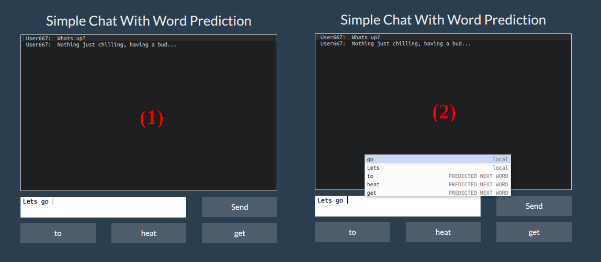

Coursera Data Science Capstone Project
========================================================
author: Zvonko Kosic

Next Word Prediction [Application](https://zvonkok.shinyapps.io/CourseraDataScienceCapstone/)

Comprehensive and brief presentation of the Coursera Data Science
Capstone Project in cooperation with the John Hopkins University
and SwiftKey.

Introduction
========================================================

The objective of this project is to build a predictive text model and demonstrate
the build algorithm in form of a shiny application.

The data that was used for the model comes from a corpus called [HC Corpora](http://www.corpora.heliohost.org/).

A data science approach (data cleaning, exploratory analysis, ...) was used to
create the application.

Last but not least it should be mentioned that the application/algorithm/model
was entirely developed in the R language ecosystem.

Approach
========================================================

The developed application for word prediction is based on a classic **N-Gram** model.

The input for the **N-Gram** model is a cleaned (lowercase, remmoving punctuation, numbers, ....)
subset of the supplied data (blogs, twitter and news)

The sample was tokenized into N-Grams, namely unigram, bigram, trigram and
quadgrams sorted by frequency.

These new data structures were then used to predict the next word depending
on the input.

The Application (Simple Chat App)
========================================================

The application is a simple chat were the user can enter his message and
the app suggests, predicts the next three words beginning with the best match (1).

Additionally to the predicted words, the application uses autocompletion to
reduce typing as seen in (2).

Last Words
========================================================

The chat app is hosted on shinyapps.io: [https://zvonkok.shinyapps.io/CourseraDataScienceCapstone/](https://zvonkok.shinyapps.io/CourseraDataScienceCapstone/)

On the shinapps.io website is a brief description how the app works and how
to use the features.

The Rpubs presentation is located here: [http://rpubs.com/zvonkok/CourseraDataScienceCapstone](http://rpubs.com/zvonkok/CourseraDataScienceCapstone)

